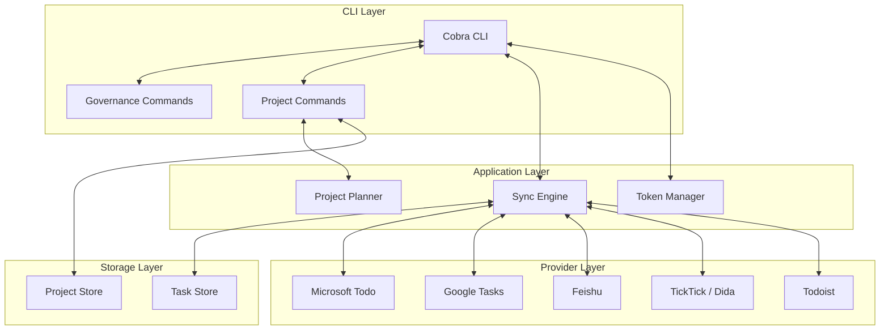

# TaskBridge 架构设计

## 概述

TaskBridge 是一个纯 CLI 的任务工作流工具。它通过统一任务模型把多个 Todo Provider 的读写、同步、项目规划和治理能力收敛到一个本地命令行入口。

## 核心设计原则

1. CLI 是唯一主入口。
2. Provider 差异被收敛到统一任务模型。
3. 项目规划与治理能力直接落在本地存储与命令层，不依赖外部协议服务。
4. 同步、规划、治理可以独立使用，也可以串成自动化脚本。

## 架构分层



## 目录结构

```text
taskbridge/
├── cmd/
├── internal/
│   ├── auth/
│   ├── model/
│   ├── project/
│   ├── projectplanner/
│   ├── provider/
│   ├── storage/
│   └── sync/
├── pkg/
└── docs/
```

## 运行时数据

- 任务存储：`<storage.path>/tasks.json`
- 项目与计划存储：`<storage.path>/projects.json`
- token 与凭证：`~/.taskbridge/`

## 当前主命令面

- 基础：`auth`、`provider`、`list`、`lists`、`task`、`sync`
- 规划：`project`
- 治理：`analyze`、`governance`
- 交互：`tui`
- 后台：`serve`
