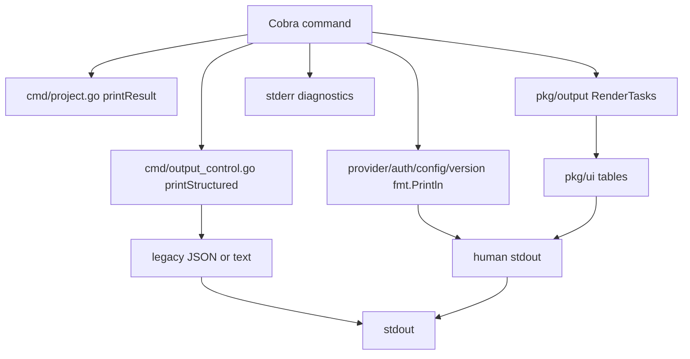
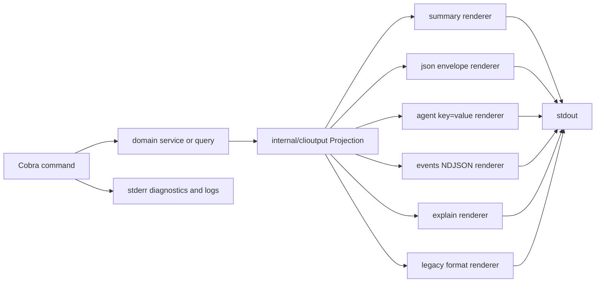
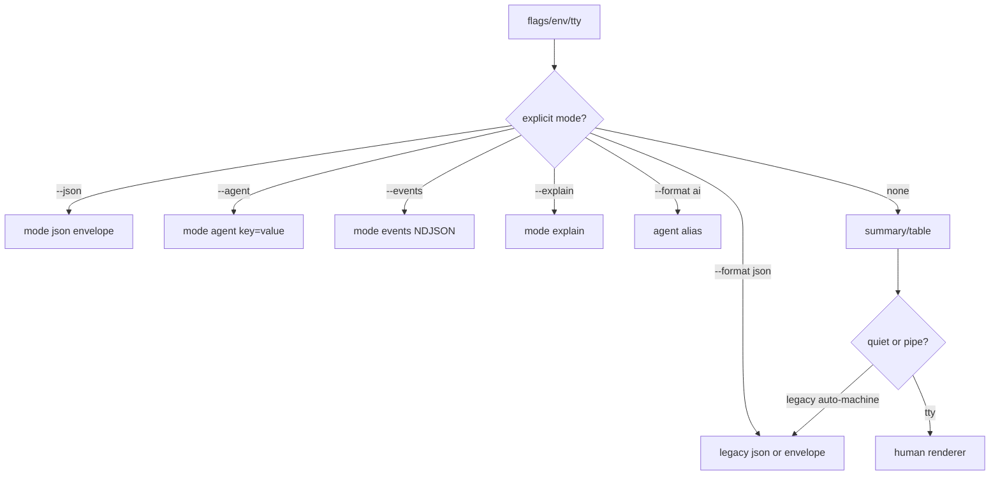

# Design: TaskBridge CLI 输出美化与合同收敛

## Design Principles

- 先合同，后视觉。默认 human 输出可以更美观，但机器输出必须稳定、无 ANSI、可解析。
- 整个 CLI tree 共享一个 output contract；单个 command result 只构建一次 projection，再由 renderer 渲染 summary/json/agent/events/explain。
- 参考 skillctl 的输出分类：分析类 stats panel；搜索和列表类 table-first；治理、详情、写入预览、解释类使用固定区块。
- 参考 GitPulse 的兼容策略：新入口显式 `--json`/`--agent`，legacy `--format json` 和 `--format ai` 有测试保护。
- CLI chrome 默认 English；机器协议字段、schema key、flag、命令名和枚举保持 English 或既有稳定名称；用户内容和第三方 payload 不被翻译。
- 不依赖颜色表达含义；`NO_COLOR=1` 和 `--color never` 后仍完整可读。

## Current State



当前主要问题：

- `config show --format json` 等命令存在 JSON 后追加人类文本的风险。
- provider/auth 已经使用 `pkg/ui`，但样式和机器输出没有统一合同。
- `list`、`lists`、`task show`、`sync`、`analyze` 仍存在手写 JSON 或格式分支。
- `pkg/output` 暴露 task renderer，和 `taskbridge-code-quality-refactor` 的 internal 化计划重叠。
- 默认输出没有 command taxonomy，所有命令都容易塞事实、证据、提示或大表格。

## Target Architecture



新增或收敛到 `internal/clioutput/`，作为普通 CLI 输出合同真源：

- `document.go`: `Projection`、`Action`、`OutputError`、`PreviewItem`、`Table`、`StatPanel`、`StatRow`、`Mode`、`Status`。
- `render_summary.go`: English summary renderer，使用固定区块和 table-first/stats-panel 分类。
- `render_json.go`: AI-native envelope renderer，失败也输出合法 envelope。
- `render_agent.go`: key=value renderer，排序、quote、key sanitization、redaction。
- `render_events.go`: NDJSON start/progress/end/error renderer，仅长任务启用。
- `render_explain.go`: English `Conclusion/Evidence/Confidence/Risks/Recommended next step`，不输出完整思维链。
- `width.go`: CJK/display width、截断、padding；可以复用 `go-runewidth` 或现有 `pkg/ui.StringWidth`。
- `color.go`: `--color auto|always|never`、`NO_COLOR`、machine mode 禁色。
- `redaction.go`: token、Authorization、cookie、password、raw prompt、provider payload 等敏感内容脱敏。

`pkg/ui` 保留为 TUI 和低层终端样式组件。普通 CLI renderer 应尽量走 `internal/clioutput`，避免把视觉 helper 当作输出合同。若实现先落在 `pkg/ui`，必须只有一个 display-width 真源，并在后续迁回 `internal/clioutput`。

## Projection Contract

```go
type Projection struct {
    SpecVersion string         `json:"spec_version"`
    Mode        string         `json:"mode"`
    Command     string         `json:"command"`
    Status      string         `json:"status"`
    Summary     string         `json:"summary,omitempty"`
    Facts       map[string]any `json:"facts,omitempty"`
    Actions     []Action       `json:"actions,omitempty"`
    Evidence    []string       `json:"evidence,omitempty"`
    Confidence  *float64       `json:"confidence,omitempty"`
    Data        any            `json:"data,omitempty"`
    Error       *OutputError   `json:"error,omitempty"`
    Preview     []PreviewItem  `json:"-"`
    Tables      []Table        `json:"-"`
    Risks       []string       `json:"-"`
    Hint        string         `json:"-"`
}
```

规则：

- `command` 使用点分英文：`provider.list`、`auth.status`、`list.tasks`、`config.show`、`version.show`、`today.view`。
- `facts` 只放 3 到 8 个高价值稳定 key，大 payload 放 `data`。
- `actions` 最多一个 primary next action 出现在默认 human 输出；JSON 可包含多个。
- `Preview` 和 `Tables` 只服务 human/table renderer，不进入 envelope 顶层。
- `Error` 必须包含稳定 `code`、English `message`、可选 `suggestion`、`retryable` 和 `details`。

## Human Output Taxonomy

| 类型 | 适用命令 | 默认输出 | 下一步 |
| --- | --- | --- | --- |
| Analysis stats panel | `analyze quadrant`、`analyze priority`、`analyze time`、`analyze trend`、`analyze report` | title + compact boxed stats rows + totals footer | 通常无；异常或空数据可给一条 |
| Result table | `list`、`lists`、`provider list`、`sync conflicts` | 只输出主表，必要时一行分页/过滤摘要 | 通常无；空结果可给一条 |
| Detail card | `provider info`、`auth show`、`task show`、`version` | `Status` + facts table/capability table | 一条真实命令 |
| Governance report | `doctor`、`auth status`、`config validate`、`governance *` | `Status`、`Highlights`、`Facts`、`Preview`、可选 `Risks` | 一条真实命令 |
| Write receipt | `task add/edit/done/undo/delete`、`provider enable/disable`、`auth logout`、write-path review/project commands | `Status`、`Highlights`、`Facts`、`Risks`、下一步 | 写前默认 dry-run 的命令必须明确 |
| Decision summary | `today`、`next`、`inbox`、`review`、`project next/review/adjust` | 20 行内摘要、风险、一个推荐下一步 | 必须有 |
| Long-running/service | `sync watch`、`serve` | human progress writes safe diagnostics to stderr where needed; machine stream uses events | 必须说明停止或查看状态命令 |
| Explain report | `review --explain`、后续判断命令 | `Conclusion`、`Evidence`、`Confidence`、`Risks`、下一步 | 必须有 |

默认 human 输出不展示 schema、evidence refs、renderer metadata 或完整 JSON。需要详情时推荐 `--json`、`--agent`、`--explain` 或领域 detail 命令。

## Visual Rules

- 表格优先使用紧凑、CJK 对齐的版式；分析类允许使用轻量边框 stats panel，例如 `taskbridge analyze priority` 的 priority distribution 面板。
- 不在 routine 输出里堆叠大卡片、彩色背景或宽边框；美化目标是扫读速度，不是装饰。
- 状态用文本加可选符号，例如 `Success`、`Partial`、`Failed`、`Not authenticated`；颜色只是辅助。
- 所有列必须有宽度策略：最小宽度、最大宽度、截断符、display width 计算、分页提示。
- `--color always` 只影响 human modes；`--json`、`--agent`、`--events`、`--explain` 默认无 ANSI，除非未来明确支持 explain color 且有禁色测试。

## Mode And Compatibility Flow



迁移时每个命令必须写清：

- 显式 `--json` 是否已是 envelope。
- `--format json` 是 legacy payload 还是 envelope alias。
- 是否支持 `--agent`。
- 是否适合 `--events` 或 `--explain`。
- pipe/quiet 自动机器输出是否保留兼容行为。

## Command Migration Order

1. Renderer foundation：`internal/clioutput`、`cmd/output_control.go`、root `--color`、contract tests。
2. Analysis panels：`analyze quadrant/priority/time/trend/report`，先落地 stats panel、空数据、百分比、totals footer、legacy `--format json` 兼容测试；`taskbridge analyze priority` 是首个验收样例。
3. Low-risk identity/config：`version`、`config show/get/validate`，先修复 JSON stdout 污染。
4. Browsing commands：`provider list/info`、`auth status/show`、`lists`，统一表格和 detail 输出。
5. Task browsing and write receipts：`list`、`task show/add/edit/done/undo/delete`，与 `taskbridge-code-quality-refactor` 的 `internal/taskoutput` 对齐。
6. Sync and long-running commands：`sync pull/push/bidirectional/status/diff/conflicts/resolve/backup/watch`、`serve`，只在 audit/evidence 地基到位后补 `--events` 和 service-safe stdout/stderr。
7. Daily control-plane：`today/next/inbox/review` 只补视觉一致性，输出合同实现由 `taskbridge-control-plane-hardening` 承接。
8. Project/governance tree：`project *`、`governance *` 使用 decision summary/governance report/write receipt 类型，保持 confirmation/dry-run gate。
9. Docs and examples：README、command docs、output design docs 只展示真实可运行命令，记录 legacy machine compatibility。

## Testing Strategy

- Renderer unit tests 覆盖 width、truncate、color、quote、redaction、sorted facts/actions。
- Contract tests 解析 `--json` stdout 为单个 object，校验 `spec_version/mode/command/status`。
- Agent tests 校验 required keys、无 ANSI、无中文段落、key 排序稳定、值 quote 稳定。
- Human tests 使用 golden 或 focused assertions：默认输出不是 JSON dump，推荐下一步最多一条，列表类不展示 schema/evidence metadata。
- Error tests 覆盖 invalid provider、storage init failure、marshal failure、config sensitive output；机器模式 stdout 保持机器对象，诊断走 stderr。
- Integration/process evidence 通过 `task test:integration` 写入 `temp/integration-test-runs/<run-id>/`，遵守子项目 evidence 规则。

## Risks

- 与 `taskbridge-code-quality-refactor` 同时移动 `pkg/output` 可能冲突。缓解：实现前先确认该 change 的 shared output helper 状态，必要时只在 `cmd/output_control.go` 适配已稳定接口。
- `--format json` 兼容策略不一致会破坏脚本。缓解：每个命令在 tasks 中写明 legacy 行为并加回归测试。
- 过度视觉化会降低可扫读性。缓解：默认 table-first 和固定区块，不把 routine 输出做成大卡片。
- emoji 或宽字符可能在不同终端宽度漂移。缓解：测试 `NO_COLOR=1`、CJK、emoji、ASCII fallback 和 `TERM=dumb`。
