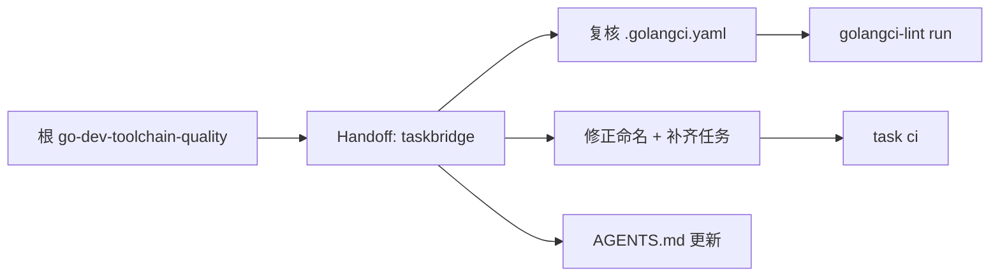

## Context

`cli/taskbridge` 有 lint 配置和 Taskfile，但命名偏历史。本项目属于"修正命名"类型。

## Goals / Non-Goals

**Goals:**

- 统一 Taskfile 的 Go 开发入口：`deps`、`mod-check`、`fmt`、`fmt-check`、`lint`、`test`、`build`、`check`、`ci`。
- `task build` 按其它 Go 子项目约定输出到 `dist/taskbridge`，并执行 `dist/taskbridge --help` smoke check。
- 修正本地 build、Docker build、GoReleaser build 的 `-trimpath` 和 `pkg/buildinfo` ldflags 对齐。
- 补齐 GoReleaser 配置校验、本地 snapshot、dry-run release 任务。
- 增加可选 Air 热加载入口；Air 不进入 `check`/`ci` 依赖。
- 保留 Docker 编排任务。

**Non-Goals:**

- 不改变 TaskBridge 的任务管理功能。

## Risks

- GoReleaser 或 Air 未安装会影响对应可选任务 -> `check`/`ci` 不依赖这些可选工具；发布前单独运行 `task release:check`。
- Docker 基础镜像必须跟 `go.mod` 的 Go 版本保持一致 -> Dockerfile 使用 Go 1.25 系列镜像。

## Closeout

- 最终验证命令：`task check`、`task lint:new`、`task test:race`、`task release:check`、`task snapshot`、`openspec validate taskbridge-go-dev-toolchain --strict`。
- 范围变化：发现 `task test:race` 暴露 `TokenManager.RefreshAll` 并发写 `results` map，已在计划内修复；用户要求本地 build 与其它 Go 子项目一致输出到 `dist/taskbridge`，已纳入最终范围。
- 延期项：无。
- 归档决策：验证通过后将本 change 归档到 `openspec/changes/archive/YYYY-MM-DD-taskbridge-go-dev-toolchain/`。
