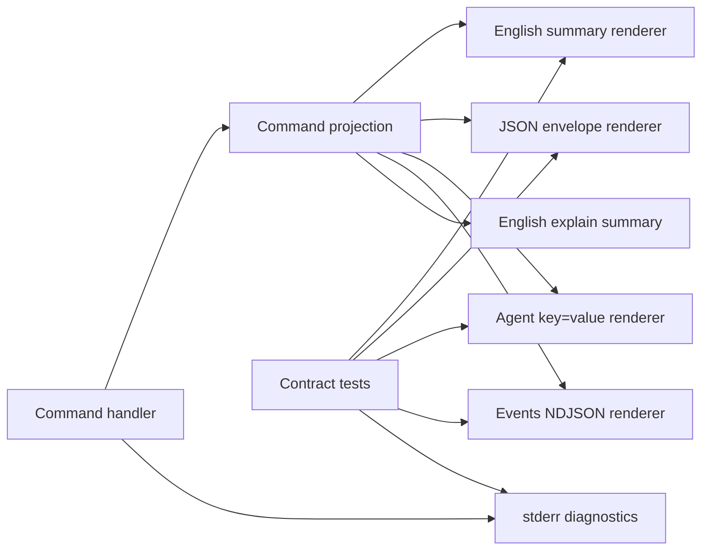

## Context

Taskbridge must converge on the repository CLI output standard in `docs/workflows/ai-native-cli-output-contract.md`. The migration should be implemented inside `cli/taskbridge`, because this subproject owns its command surface, tests, docs, and release evidence.

## Goals

- Make English the default for human-readable command output, help, errors, diagnostics, operator logs, and explain summaries.
- Preserve stable machine contracts for `--json`, `--agent`, and `--events` without requiring agents or scripts to parse human text.
- Keep one projection as the source of truth for all renderers, so human and machine modes cannot drift.
- Add focused tests that detect non-English labels in user-visible CLI surfaces and detect prose, color, or logs in machine stdout.
- Update subproject documentation and examples with real commands a human can run.

## Non-Goals

- Do not translate user-authored domain content, quoted source material, provider response text, fixture story content, or product data that is intentionally non-English.
- Do not rename existing commands, flags, config keys, JSON fields, schema fields, enum values, event types, provider ids, or model ids solely for this migration.
- Do not store full chain-of-thought, raw prompts, hidden system prompts, unredacted provider payloads, private tool arguments, or model-internal reasoning in output, tests, traces, fixtures, or evidence.
- Do not add a parallel output framework if the subproject already has a renderer/projection package that can be extended.

## Architecture

The command handler should produce structured facts, actions, evidence, status, and errors once. Renderers then project the same data into human, JSON, agent, event, or explain formats. Default human output uses English section labels such as `Status`, `Highlights`, `Risks`, `Evidence`, and `Recommended next step`. Machine output never includes localized prose, ANSI, banners, progress bars, or diagnostics on stdout.

## Migration Strategy

1. Inventory all output surfaces before editing code: commands, help, errors, task runner text, docs, tests, fixtures, and golden files.
2. Add failing tests for representative commands and known localized output before translating implementation text.
3. Move command-local string rendering into the existing projection/renderer layer where possible.
4. Translate user-visible CLI strings to English while preserving machine keys and domain data.
5. Validate focused output tests, full project tests, build, OpenSpec validation, and integration evidence when integration or e2e entrypoints are touched.

## Compatibility

- Human output may change language in this migration.
- Machine output must remain parseable and versioned. Any removal, rename, or required-field change must follow the contract versioning rules.
- Legacy localized human snapshots should be updated only after behavior tests prove machine output remains stable.
- Scripts and agents should consume `--json`, `--agent`, or `--events`, not default English summaries.

## Risks

- Risk: tests overfit exact prose. Mitigation: assert stable section labels, required actions, parseability, and absence of forbidden leaks rather than long paragraphs.
- Risk: translation changes domain content. Mitigation: mark quoted/user-authored/product content as data and exclude it from CLI chrome translation.
- Risk: machine mode regressions are hidden by human tests. Mitigation: parse `--json`, parse `--agent`, and validate NDJSON independently.
- Risk: long-running commands mix logs into stdout. Mitigation: write diagnostics to stderr and reserve stdout for the selected machine stream.

## Verification Entry Points

- Focused tests: `go test ./cmd -run 'Output|English|Agent|JSON|Help|Provider|Auth|List|Config|Version' -count=1`.
- Build or typecheck: `go test ./... && go build -trimpath -o dist/taskbridge .`.
- Integration evidence when applicable: `task test:integration`.
- OpenSpec validation: `openspec validate english-cli-output-contract --strict`.
