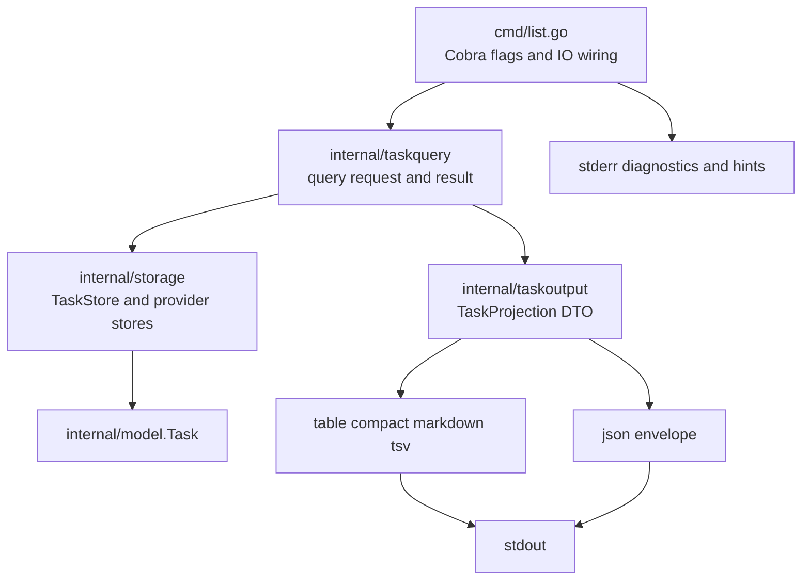
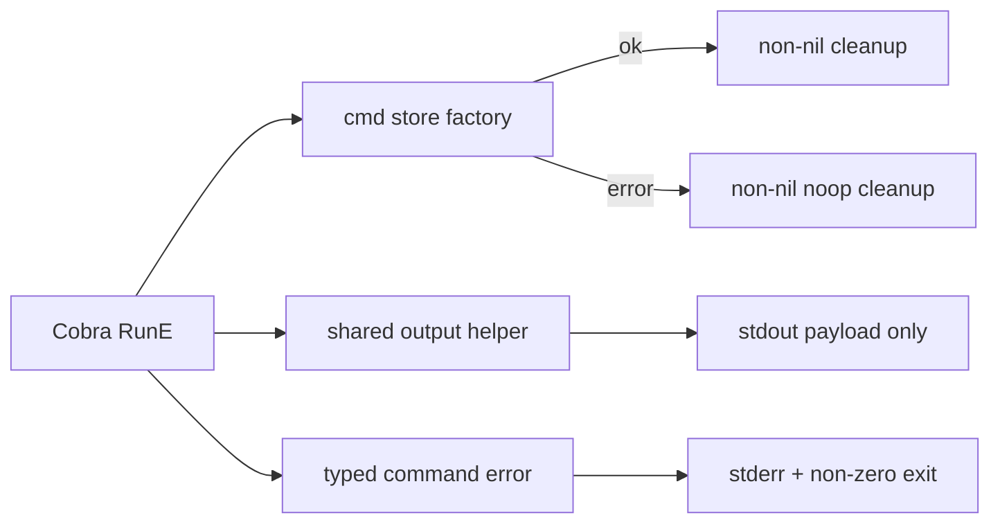
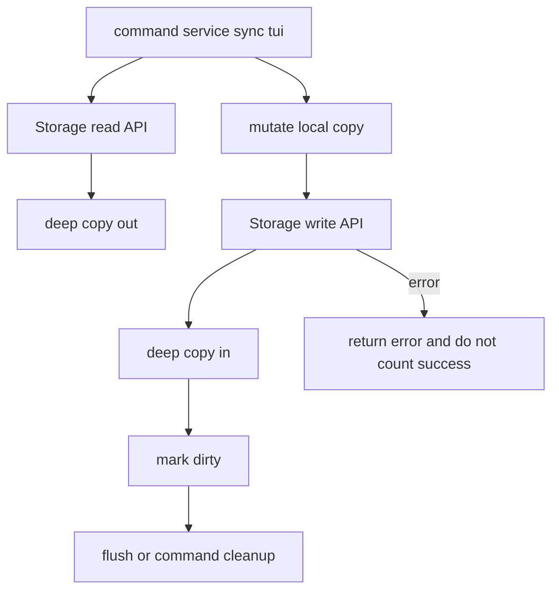

# Design: TaskBridge 代码质量和 CLI 输出契约重构

## 设计边界

本 change 只处理 TaskBridge CLI 的代码质量边界：命令层、查询层、任务输出 projection/render、provider catalog、filestore 查询复用和对应测试。业务模型仍以 `internal/model` 为真源；provider 客户端、同步协议和 TUI 行为不在本次重构范围内。

## 目标结构

## 关键决策

- `cmd/list.go` 只保留 flag 解析、storage 注入、stdout/stderr 连接和 exit behavior；过滤、排序、分页、projection、render 不回到 `cmd` 包。
- 任务渲染从公开 `pkg/output` 移到 `internal/taskoutput`。如果后续需要外部 SDK，再定义不依赖 `internal/model` 的稳定 DTO，不复用 CLI 内部 projection。
- `internal/taskoutput` 以一个 projection 多个 renderer 为核心：先把 `model.Task` 转成只含输出字段的 `TaskProjection`，再渲染 JSON/table/compact/tsv/markdown。
- `--format json` stdout 必须只输出一个 JSON object。空结果、分页信息、筛选摘要和提示信息必须进入 JSON 字段或 stderr，不能追加人类文本。
- 人类输出可以继续保留中文提示，但提示由 renderer 或命令层按输出模式显式决定，不能在通用查询层产生。
- provider 名称、状态、配置 loader 和 storage 默认遍历统一通过 `provider.GetAllProviderNames()` 或后续 catalog API，不再新增硬编码 provider 列表。
- filestore 的过滤、排序、分页保持在共享 helper 内；`FileStorage` 和 `ProviderStorage` 不各自维护同一套查询逻辑。
- `getStore()` 和 `getCLIStores()` 的 cleanup contract 必须是非 nil；调用方也应在 `err == nil` 后再 `defer cleanup()`，避免初始化失败路径被 nil defer 覆盖。
- 缺凭证、token 读取失败、provider 不支持、序列化失败都必须返回 `commandError` 或 `usageError`，不能只打印错误后返回 nil。
- `printStructured` 或后续 `internal/clioutput` 是命令层唯一 JSON/text 分流入口；`cmd/analyze.go`、`cmd/lists.go`、`cmd/sync.go`、`cmd/task.go` 不再各自手写 `json.MarshalIndent` 和 `fmt.Println(string(data))`。
- `FileStorage`、`ProviderStorage` 和 `MultiProviderStorage` 的读 API 返回深拷贝；写 API 也保存输入对象的深拷贝。`Task.Metadata.CustomFields`、`Tags`、`Categories`、`SubtaskIDs`、`*time.Time` 字段不能与调用方共享可变引用。
- 同步、项目同步和 TUI mutation path 不允许忽略 `SaveTask`、`SaveTaskList`、`DeleteTask`、`SaveProject`、`SetLastSyncTime`、`Flush` 的错误；如果写入失败，result 需要记录错误，成功计数不能增加，UI 需要保留可见错误状态。

## 测试策略

- 查询和 projection 使用 Go table-driven unit tests，覆盖状态、provider、优先级、日期、搜索、排序、分页和截断。
- 命令级 stdout/stderr 契约使用 `github.com/rogpeppe/go-internal/testscript` 或项目内等价 process harness；如果先沿用现有 Go test harness，必须在 `design.md` 或测试注释说明为什么暂不引入 testscript。
- JSON 输出测试必须实际解析 stdout，不能只做字符串包含断言。
- 存储初始化失败测试必须覆盖 `--storage-path` 指向已有文件的场景，期望返回非零错误、stderr 有可解释信息、stdout 不含 panic 栈。
- auth 退出码测试必须覆盖 Microsoft/Feishu 缺凭证、TickTick/Dida token 读取失败；期望非零退出码并保留中文修复建议。
- storage ownership 测试必须 mutate `GetTask`、`ListTasks`、`QueryTasks` 返回值中的顶层字段、slice、map 和 `Metadata.CustomFields`，确认未调用 `SaveTask` 时 store 内部状态不变。
- persistence error 测试必须使用会返回错误的 fake store 覆盖 sync/project/TUI 写路径，确认错误被返回或显示，不会被计入成功结果。
- 命令级、process e2e 或 golden 测试运行证据写入 `temp/integration-test-runs/<run-id>/`，并脱敏环境变量、token、provider payload 和 raw prompt。

## 迁移步骤

1. 先补 RED 测试锁住当前缺陷：`list --format json` 空结果和分页场景 stdout 不是纯 JSON。
2. 移动 task renderer 到 `internal/taskoutput`，同步迁移所有引用，删除或缩小 `pkg/output`。
3. 拆分 task output 文件，确保 projection、JSON、human table、delimited、markdown 各自职责清晰。
4. 修正 `cmd/list.go` 的输出分流，让 JSON mode 只走 JSON renderer，人类提示走 stderr 或 human renderer。
5. 补 provider catalog 和 filestore 查询一致性测试，防止重构后漂移。
6. 修复 store cleanup contract，并补初始化失败回归测试。
7. 修复 auth 错误路径退出码，并把 provider 指引输出收敛到可测试 helper。
8. 将 analyze、lists、sync、task show 迁入共享输出 helper，删除手写 JSON 分支。
9. 修复 storage ownership 和持久化错误吞噬问题，确保读写边界和成功计数可信。
10. 跑全量验证并用 OpenSpec closeout 记录证据。

## 不做

- 不为旧 `pkg/output` API 提供 shim。
- 不改变任务存储文件格式、MongoDB schema 或 provider auth flow。
- 不把所有命令都一次性重构到统一 application service；本 change 先以 `list` 为示范路径，后续命令按同一模式逐步迁移。
- 不重写 TUI 交互模型；本 change 只处理 TUI 写入错误不能被静默吞掉的问题。
