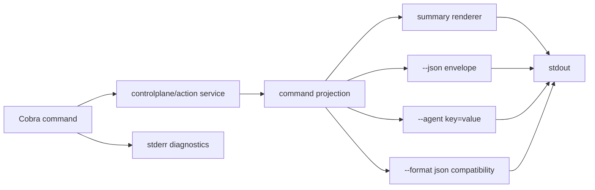
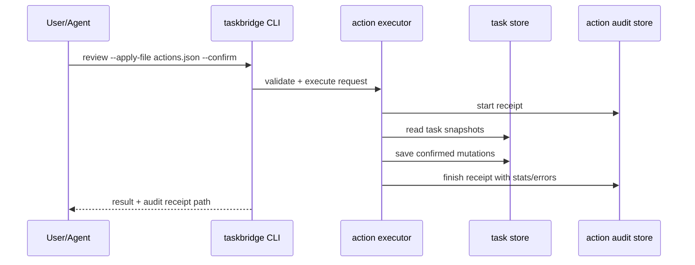

## Context

TaskBridge 已经具备多 Provider、任务列表、项目拆分、治理命令、`today/next/inbox/review` 控制面命令和 `taskbridge agent *` 入口。CEO review 的结论是产品方向正确，但阶段顺序已经被实现打穿：Agent 写入和 review action 执行已经存在，而审计、schema 校验、输出模式和测试证据还没有形成完整闭环。

当前约束：

- 继续保持 CLI 为唯一核心入口，不新增常驻 MCP/HTTP 核心服务。
- 不让 Agent 或 adapter 直接读写 `~/.taskbridge`、Provider token 或 Provider API。
- 不在本 change 中新增 Todo Provider、重写 TUI、做完整双向同步或复杂日程排程。
- 机器协议字段保持英文和稳定命名，用户可见说明和 `--explain` 类摘要使用中文。
- 结构化 receipt、audit、evidence 必须由 CLI/application service 生成，不能要求 agent 手写 JSON/YAML/JSONL metadata。

## Goals / Non-Goals

**Goals:**

- 让用户在无 Provider 认证时通过 `taskbridge demo today` 或等价命令看到核心价值。
- 让 `today/next/review` 成为主入口，并为 `--json`、`--agent`、legacy `--format json` 建立同一 projection。
- 让 `review --apply-file` 和 `taskbridge agent execute` 的 dry-run/confirm 行为可审计、可复验、可失败可见。
- 让 `taskbridge agent *` 错误路径既保持 JSON stdout，又用非零 exit code 告诉脚本失败。
- 为命令级/process e2e/golden 测试提供 `task test:integration` evidence 入口。

**Non-Goals:**

- 不新增真实 Provider 或改变外部 Provider 协议。
- 不实现完整 sync diff/conflict/backup restore 系统，只为 action file 本地任务写入建立最小审计。
- 不把所有历史命令一次性迁移到 AI Native CLI 五模式；本 change 先覆盖控制面和 agent/write path。
- 不移除 `--format json`，只增加明确的 `--json` 和 `--agent` 路径并保留兼容窗口。
- 不新增 MCP adapter。adapter 必须等 CLI agent contract 稳定后再薄封装。

## Decisions

### Decision 1: hardening first, features second

先完成控制面 hardening，再继续 Phase 3 项目执行闭环或 Phase 4 MCP adapter。原因是当前 `agent execute --confirm` 和 `review --apply-file --confirm` 已能真实改本地任务；没有 audit receipt、错误 exit contract 和 evidence 的写入路径不应继续扩展。

替代方案：继续堆 Provider 或项目闭环。放弃原因：这些能力会增加用户入口和写入路径，但不会修复“用户和 Agent 是否能信任结果”的根问题。

### Decision 2: one projection, multiple renderers

控制面命令使用同一个 command projection 渲染默认中文 summary、`--json` envelope、`--agent` key=value 和 legacy `--format json`。不允许从中文 human text 反解析 JSON，也不允许每个命令手写 `json.MarshalIndent` 分支。

替代方案：只修正现有 `--format json`。放弃原因：它能保住脚本解析，但无法满足仓库级 `--agent`、`--json` envelope、错误 envelope 和 schema version 规范。

### Decision 3: action execution audit is local and CLI-authored

新增 `internal/actionaudit` 或等价 application service。`review --apply-file` 和 `taskbridge agent execute` 调用同一 executor facade，执行前后生成 audit receipt。receipt 存在 TaskBridge storage path 下的审计目录，由 CLI/service 写入，字段包含 schema、session_id、command、dry_run、confirm、action_file、started_at、finished_at、status、stats、operations、errors 和 redaction policy。

替代方案：只把执行结果打印到 stdout。放弃原因：stdout 不能承担长期审计和复验职责，失败后也容易丢失上下文。

### Decision 4: agent errors return JSON and non-zero exit code

`taskbridge agent *` 的失败路径必须在 stdout 输出 `taskbridge.agent-result.v1` 或兼容 envelope，同时命令返回错误状态，让 shell/CI 能看到失败。需要避免 cobra 默认错误文案污染机器 stdout；诊断走 stderr，机器对象走 stdout。

替代方案：保持现有 JSON error 但 exit code 0。放弃原因：脚本会把认证失败、schema 不支持、action file 无效误判为成功。

### Decision 5: integration evidence is a Taskfile entrypoint, not a second test framework

Go 单元测试继续用 Go `testing`。命令级/process e2e/golden 使用 `github.com/rogpeppe/go-internal/testscript` 或现有 harness，但统一通过 `task test:integration` 包一层 evidence writer，保证成功和失败都落盘。

替代方案：只在 CI 上传测试日志。放弃原因：本地 agent 交接和失败复验需要稳定本地证据，不应依赖 CI 才能追踪。

## Risks / Trade-offs

- [Risk] 与 `taskbridge-code-quality-refactor` 同时改输出 helper 产生冲突 -> [Mitigation] 本 change 的实现任务依赖 shared output helper；如未完成，先在该 change 收口 helper，再做本 change。
- [Risk] `taskbridge agent *` 改 exit code 可能影响依赖 exit 0 的旧脚本 -> [Mitigation] 文档写明错误路径修正为 contract bugfix，并为 `requires_confirmation=true` 返回约定单独测试。
- [Risk] audit receipt 保存任务标题等本地任务信息，可能进入测试证据或日志 -> [Mitigation] receipt 不保存 token/provider payload，evidence wrapper 对 path/env/stdout/stderr 统一脱敏。
- [Risk] 同时支持 `--format json`、`--json` 和 `--agent` 增加复杂度 -> [Mitigation] 用同一 projection，renderer 只做输出转换，contract tests 锁 stdout/stderr。
- [Risk] demo path 和 mock path 分叉 -> [Mitigation] `taskbridge demo today` 复用现有 `controlplane.NewMockService` 或同一个 fixture provider，不维护第二套业务规则。

## Migration Plan

1. 先补 contract tests：agent error exit、action audit receipt、control-plane `--json`/`--agent`、integration evidence。
2. 引入 shared projection/render path，并保留 legacy `--format json`。
3. 引入 action audit service，先覆盖本地 task action，不扩展到远端 Provider 写入。
4. 更新 README/docs，把主路径改为 `doctor -> demo today -> today -> next -> review -> agent execute`。
5. 跑 `go test ./...`、`task test:integration`、`go build ./...` 和 `openspec validate taskbridge-control-plane-hardening --strict`。

Rollback：如果输出模式变更破坏脚本，保留 `--format json` 原 JSON payload 路径；如果 audit 写入失败，confirmed action 必须失败而不是静默执行。Git revert 应能回退本 change，不需要数据 migration。

## Open Questions

- `taskbridge demo today` 是否作为新顶级 `demo` 命令实现，还是把现有 `today --mock` 作为正式 demo path 并补 alias？推荐新增 `demo today`，保留 `today --mock` 给测试。
- audit receipt 路径放在 `<storage.path>/audit/actions/` 还是 `~/.taskbridge/audit/actions/`？推荐跟随 storage path，便于项目隔离和测试。
- `taskbridge agent schemas` 是输出 schema 名称加文件路径，还是直接输出 schema 内容？推荐 `--json` 输出 schema index，`--schema <id>` 或后续命令输出具体 schema。
