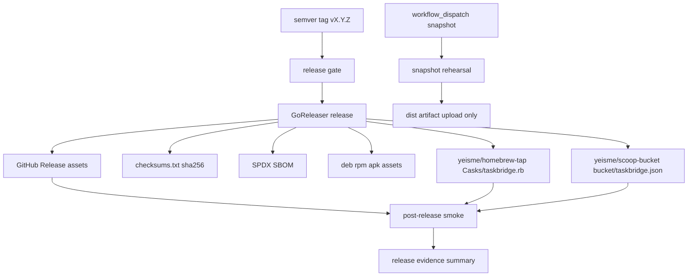

## Context

TaskBridge already has a GoReleaser skeleton, but its distribution story is weaker than `skillctl`: Homebrew is configured as a formula while `skillctl` uses casks, post-release smoke coverage is missing, release docs still contain local-machine paths, and package publishing token boundaries are not explicit enough.

The desired release model is a clean cutover to the `skillctl` package-publishing pattern. One trusted semver tag should produce all first-party release artifacts and update external package indexes. Snapshot releases should prove buildability without publishing package-manager metadata.

## Goals

- Publish TaskBridge through GitHub Release archives, checksums, source archive, SBOM, nFPM packages, Homebrew cask, and Scoop manifest.
- Keep package-manager installation side-effect free: install the binary only, with no credential creation, provider login, state initialization, or remote writes.
- Separate GitHub Release permissions from tap/bucket publishing permissions.
- Add post-release smoke checks that exercise the installed binary and no-auth demo path.
- Make release docs English, current, and runnable without local wrapper paths.

## Non-Goals

- Do not add Chocolatey, Winget, Cloudsmith, APT/YUM/APK repositories, Docker images, Snap, or MCP registry publishing in this change.
- Do not change provider sync behavior, auth behavior, storage layout, task model semantics, or command output contracts except release/install text that this change owns.
- Do not preserve the old Homebrew formula path as a compatibility alias once the cask is adopted.
- Do not publish package-manager updates during snapshot releases.
- Do not require package installers to execute remote setup scripts or write user runtime state.

## Architecture

GoReleaser remains the only artifact producer. GitHub Actions owns orchestration, gates, token minting, and evidence upload. Package-manager repos receive generated manifests from GoReleaser, not hand-written files in this repository.

## Release Artifact Contract

- Archives: Linux, macOS, and Windows for `amd64` and `arm64`; Windows uses `.zip`, other platforms use `.tar.gz`.
- Archive names include project, version, OS, and normalized architecture so post-release smoke can locate exact assets without guessing.
- Checksums: one `checksums.txt` using `sha256`.
- SBOM: SPDX JSON generated for release archives.
- nFPM: `.deb`, `.rpm`, and `.apk` files remain direct GitHub Release assets; they are not advertised as repository-backed APT/YUM/APK channels.
- Homebrew: cask published to `yeisme/homebrew-tap` under `Casks/taskbridge.rb`.
- Scoop: manifest published to `yeisme/scoop-bucket` under `bucket/taskbridge.json`.

## Token And Permissions Model

Tag releases use two distinct credentials:

1. `${{ secrets.GITHUB_TOKEN }}` for the current repository GitHub Release.
2. `PUBLISHER_TOKEN`, preferably minted by `actions/create-github-app-token`, for cross-repository writes to `homebrew-tap` and `scoop-bucket`.

The same long-lived PAT must not be the default design for both the release repository and package-index repositories. If the GitHub App cannot be created immediately, a temporary PAT path may be documented as an operator exception, but the workflow should make the short-lived token path the intended state.

## Workflow Design

### Snapshot path

`workflow_dispatch` runs a snapshot release rehearsal only:

- `go mod download`
- `go mod verify`
- `task test`
- `task build`
- `task release:check`
- `goreleaser release --snapshot --clean --skip=publish`
- local binary smoke: `taskbridge --version`, `taskbridge --help`, and `taskbridge demo today`
- upload `dist/` as a workflow artifact

### Tag release path

A semver tag runs the release gate before publishing:

- dependency verification and `go mod tidy` diff check
- `task test`
- `task test:integration`
- release config check
- focused release smoke for the built binary
- GoReleaser publish with separate release and package-publisher tokens

OpenSpec validation should be kept in project-local release gates only if the runner has the required `openspec` binary. If the existing project gate already guarantees OpenSpec before tagging, the release workflow must not introduce an unavailable external tool as a hard dependency.

### Post-release path

A separate post-release workflow runs on `release.published` and `workflow_dispatch` with an explicit tag:

- download `checksums.txt`
- download the platform archive for the runner
- verify sha256
- unpack archive
- run `taskbridge --version`
- run `taskbridge --help`
- run `taskbridge demo today`
- on macOS, install through Homebrew cask and repeat the binary smoke
- on Windows, validate Scoop manifest install when bucket credentials and runner support are available; otherwise keep manifest-generation checks in the release gate and add Windows install smoke as a follow-up task in this same change before closeout

## Documentation Design

Docs should describe supported installation paths in this order:

1. Homebrew cask
2. Scoop
3. GitHub Release archives
4. Go install
5. Direct `.deb`/`.rpm`/`.apk` release assets

Docs must not include local machine paths, local wrapper commands, or unverifiable package channels. They should state that package installers do not configure provider credentials; users still run `taskbridge doctor`, `taskbridge quickstart`, and provider auth commands after installation.

## Risks

- Risk: Homebrew formula users are disrupted. Mitigation: this change intentionally makes a clean cutover to the cask path and updates all docs to one install command.
- Risk: tap/bucket publisher token can overreach. Mitigation: use a separate GitHub App token scoped only to `homebrew-tap` and `scoop-bucket`.
- Risk: post-release smoke overfits archive names. Mitigation: use the artifact naming contract and checksum file rather than scraping release HTML.
- Risk: nFPM assets are mistaken for package repositories. Mitigation: docs call them direct release assets only.
- Risk: release workflow fails because local GoReleaser is absent. Mitigation: CI installs GoReleaser through the official action; local docs call out `task release:check` as an operator prerequisite.

## Verification Entry Points

- Release config: `task release:check`.
- Snapshot rehearsal: `task release:local`.
- Project tests: `task test`.
- Integration evidence: `task test:integration`.
- Release binary smoke: `taskbridge --version`, `taskbridge --help`, `taskbridge demo today`.
- OpenSpec validation: `openspec validate taskbridge-release-distribution --strict` from `cli/taskbridge`.
