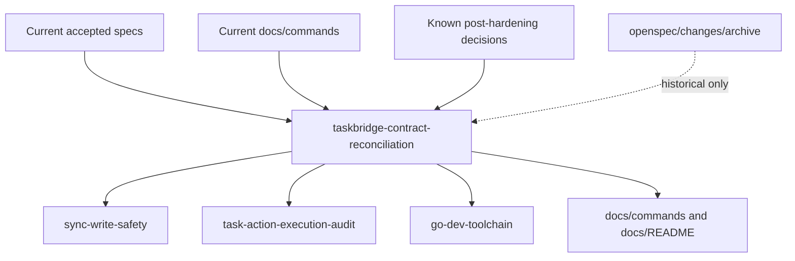

# Design: TaskBridge Contract Reconciliation

## Context

TaskBridge is positioned as a local task execution control plane for humans and agents. The current control plane, agent output, audit, integration evidence, and release contracts are stable enough that follow-up planning should not reinterpret old Chinese-output or sync-only wording as current scope.

The reconciliation keeps the product contract narrow: accepted specs and current docs become the source of truth; archived changes remain historical evidence.

## Contract Surfaces

- CLI output contract: docs and specs continue to require English default human output and stable machine modes. No wire fields change.
- Sync safety contract: the same confirmation rule applies to every entry point that can perform remote overwrite or delete.
- Agent action contract: reserved dangerous action names are not a capability advertisement.
- Development toolchain spec: language cleanup only, no Taskfile or build behavior change.

## Decisions

### Current specs and docs are authoritative

Only current specs and current docs are updated. Archived OpenSpec changes may still say "Chinese summary" or older sync scope because they describe previous planning snapshots.

### Confirmation follows the write path, not the command name

Remote destructive safety is tied to Provider mutation risk. `sync push`, `sync bidirectional`, `sync watch`, and `serve --sync` must all preserve dry-run and confirmation semantics for remote overwrite/delete paths. Background or scheduled entry points use explicit confirmation, including `--sync-confirm` for `serve`.

### Reserved dangerous actions are not implemented capabilities

`remote_write` and `conflict_discard` remain useful as reserved dangerous action labels so agents know they cannot be silently executed. Their presence in validation or audit language must not imply TaskBridge currently supports remote write execution through `agent execute`.

## Compatibility Review

- breaking_surfaces: none
- openspec_change: taskbridge-contract-reconciliation
- deprecation_window: not required
- rollback: revert this docs/spec change or archive reversal before implementation depends on it
