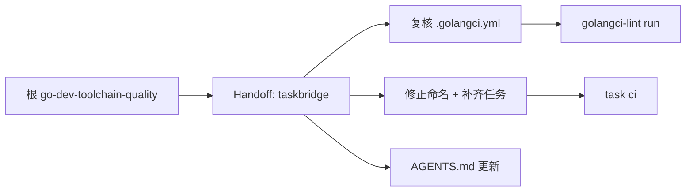

## Context

`cli/taskbridge` 有 lint 配置和 Taskfile，但命名偏历史。本项目属于"修正命名"类型。

## Goals / Non-Goals

**Goals:**

- 修正 Taskfile 命名问题（如 `goreleaser build --snapshot -- clean` 拼写）。
- 补齐 `fmt-check` 任务。
- 规范 `check`/`ci` 顺序。
- 评估可选 Air 热加载。
- 保留 Docker 任务。

**Non-Goals:**

- 不改变 TaskBridge 的任务管理功能。

## Risks

- 命名修正可能影响已有开发习惯 -> 加别名保持兼容过渡。
